<a href="./README.md">🇺🇸 English</a> &nbsp;·&nbsp; <a href="./README.zh-CN.md">🇨🇳 简体中文</a> &nbsp;·&nbsp; <a href="./README.ja.md">🇯🇵 日本語</a> &nbsp;·&nbsp; <b>🇰🇷 한국어</b>

 

## 나에 대해

안녕하세요, Zoyaya입니다. 그냥 좋아서 들썩이는 사람입니다. Go와 Python은 재미로 만지고, 라우터가 마음에 안 들면 OpenWrt를 파고들고, 방송과 영상 도구에 남은 주말을 다 바칩니다. 어느 것도 직업이 아니고, 전부 호기심과 약간의 고집입니다.

주로 만지는 언어는 Go와 Python, Windows 작은 도구는 C#입니다. 우연히 OpenWrt에 빠진 것이 시작으로, iStoreOS용 LuCI 앱을 여러 개 만들었고 가장 공을 들인 것은 luci-app-model-gateway입니다. 여러 대형 모델의 무료 사용량을 한데 모아 하나의 API로 마음껏 쓸 수 있고, 대화가 끊기지 않습니다.

모두 직접 만드는 건 아닙니다. 남의 프로젝트에 PR을 보내는 게 남은 시간의 쓰임새입니다. 방송용 조종 패널이 필요해 vMixUTC에 다국어 지원과 캔버스 모드를 제안했고 버그 수정도 많이 보냈습니다. 오픈소스 AI 영상 워크벤치인 Nomi에도 기능 코드를 틈틈이 보냅니다. 합쳐진 것도 있고 더 다듬어야 할 것도 있습니다. merge 알림은 볼 때마다 기분이 좋습니다.

잘 돌아가게 된 것은 영상 사이트에 올려두고, 밟아온 함정도 함께 기록합니다. 도구는 창작을 위해 존재하지, 창작을 방해하는 게 아니라고 생각한다면 우리는 잘 통할 겁니다.

 

## 주요 프로젝트

  &nbsp;
  

  

세 프로젝트입니다. luci-app-model-gateway는 직접 만든 것이고, vMixUTC는 상류 기여입니다. 세 번째는 iStore/OpenWrt 앱 모음 저장소로, applications/luci-app-cloudreve에 소프트 라우터에서 도는 저장소 앱이 있습니다.

 

## 기술 스택

  

  &nbsp;
  &nbsp;
  &nbsp;
  &nbsp;
  &nbsp;
  &nbsp;
  &nbsp;
  

 

## GitHub 기록

  &nbsp;
  

  

 

  

 

## 최근 하고 있는 일

- Nomi: 오픈소스 AI 영상 워크벤치. 제 프로젝트는 아니고 상류에 기능 PR을 보내고 있습니다

- luci-app-model-gateway: 직접 만든 AI 게이트웨이, 개선 중. 사용량 통합, 라우팅, 캐시, 헬스 체크

- vMixUTC: 상류에 다국어 지원과 캔버스 모드를 제안하고, 버그 수정도 계속 보내는 중

- 영상 사이트: 돌아가게 된 것들을 올리고, 워크플로 푸념도 가끔

 

## 연락처

도움이 되셨다면 ★ 하나가 가장 큰 응원입니다.

  &nbsp;
  

<!--
  贪吃蛇动效（可选）：把 snake.yml 放到 .github/workflows/ 并 push，
  等 Actions 跑完后，取消下面两行的注释即可显示。

-->
