<b>🇺🇸 English</b> &nbsp;·&nbsp; <a href="./README.zh-CN.md">🇨🇳 简体中文</a> &nbsp;·&nbsp; <a href="./README.ja.md">🇯🇵 日本語</a> &nbsp;·&nbsp; <a href="./README.ko.md">🇰🇷 한국어</a>

 

## About me

Hi there, I'm Zoyaya, just a hobbyist who enjoys taking things apart. Go and Python are what I poke at for fun; when something about my router annoys me I dig into OpenWrt; live shows and video tools eat the rest of my weekends. None of this is a day job. It's curiosity, plus a bit of stubbornness.

The languages I fiddle with are Go and Python, with C# for small Windows tools. It started as an OpenWrt rabbit hole, then a few LuCI apps for iStoreOS. The one I care about most is luci-app-model-gateway: it pools the free quotas of several LLM providers behind a single API, so your conversation never drops mid-way.

I don't build everything myself, though. PRs into other people's repos take up the rest of my time. Running live shows needed a decent controller, so vMixUTC got a full multi-language rebuild, a canvas mode, and a pile of bug fixes from me. Nomi, an open-source AI video workbench, gets feature contributions on and off. Some of it merged, some needs another round. That merged notification never gets old.

Whatever finally works ends up on a video site, along with the bugs I stepped on. If you also believe tools should serve creation instead of getting in its way, we'll probably get along.

 

## Featured projects

  &nbsp;
  

  

luci-app-model-gateway is my own; vMixUTC is a contribution upstream. The third card is the iStore/OpenWrt app collection, click through to the applications/luci-app-cloudreve folder, a netdisk app that runs on soft routers.

 

## Tech stack

  

  &nbsp;
  &nbsp;
  &nbsp;
  &nbsp;
  &nbsp;
  &nbsp;
  &nbsp;
  

 

## GitHub at a glance

  &nbsp;
  

  

 

  

 

## What I'm up to lately

- Nomi: an open-source AI video workbench I send feature PRs to, not my project

- luci-app-model-gateway: my own AI gateway, still evolving. Quota pooling, routing, caching, health checks

- vMixUTC: multi-language support and a canvas mode submitted upstream, plus a long tail of bug fixes

- A video site: whatever I get working, and the occasional rant about workflows

 

## Find me

If anything here is useful, a ⭐ is all the encouragement I need.

  &nbsp;
  

<!--
  贪吃蛇动效（可选）：把 snake.yml 放到 .github/workflows/ 并 push，
  等 Actions 跑完后，取消下面两行的注释即可显示。

-->
