<a href="./README.md">🇺🇸 English</a> &nbsp;·&nbsp; <b>🇨🇳 简体中文</b> &nbsp;·&nbsp; <a href="./README.ja.md">🇯🇵 日本語</a> &nbsp;·&nbsp; <a href="./README.ko.md">🇰🇷 한국어</a>

 

## 关于我

你好呀，我是 Zoyaya，一个喜欢瞎折腾的爱好者。Go 和 Python 是图一乐才写的；路由器哪里不顺眼，就钻进 OpenWrt 修；直播和视频工具占满了剩下的周末。没有一样是正职，全是好奇心作祟，外加一点倔。

平时鼓捣的语言是 Go 和 Python，写小工具换 C#。当初因为 OpenWrt 入坑，后来给 iStoreOS 写了几个 LuCI 应用，最上心的是 luci-app-model-gateway：把多家大模型的免费额度聚到一起，一个接口随便用，对话不断联。

也不是什么都自己造。给别人的项目提 PR 占了剩下的时间：直播缺个像样的控制台，就给 vMixUTC 提了完整的多国语言和画布模式，附赠一堆 bug 修复；Nomi 那个开源 AI 视频工作台，也陆陆续续交了些功能代码。有的合了，有的还要再磨，但每次看到 merged 都挺开心。

折腾出点名堂的东西，会丢到一个视频网站上，顺便记下踩过的坑。如果你也觉得工具应该服务于创作，而不是给创作添堵，那我们大概能聊到一块去。

 

## 精选项目

  &nbsp;
  

  

三个项目：luci-app-model-gateway 是自己写的；vMixUTC 是给上游提的贡献；第三个是 iStore/OpenWrt 应用集合仓库，点进 applications/luci-app-cloudreve 目录，那是跑在软路由上的网盘应用。

 

## 技术栈

  

  &nbsp;
  &nbsp;
  &nbsp;
  &nbsp;
  &nbsp;
  &nbsp;
  &nbsp;
  

 

## GitHub 数据

  &nbsp;
  

  

 

  

 

## 最近在做的事

- Nomi：开源的 AI 视频工作台，我在给上游提功能 PR，不是我的项目

- luci-app-model-gateway：自己写的 AI 网关，持续迭代。额度聚合、路由、缓存、健康检测都在补

- vMixUTC：给上游提交了多国语言和画布模式，外加一连串 bug 修复

- 一个视频网站：折腾出点名堂的都发上去，偶尔吐槽工作流

 

## 找到我

项目对你有用的话，顺手点个 ⭐，这就是我继续折腾的动力。

  &nbsp;
  

<!--
  贪吃蛇动效（可选）：把 snake.yml 放到 .github/workflows/ 并 push，
  等 Actions 跑完后，取消下面两行的注释即可显示。

-->
